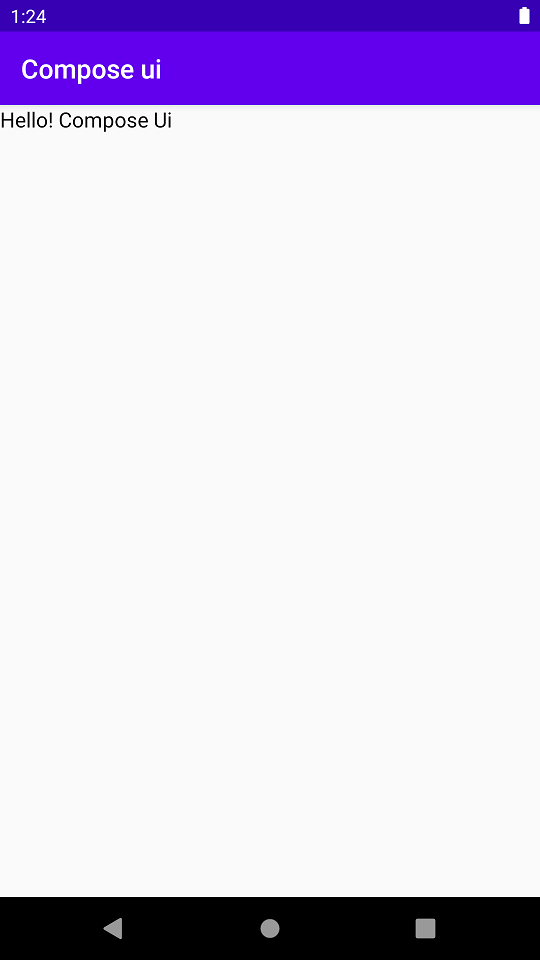
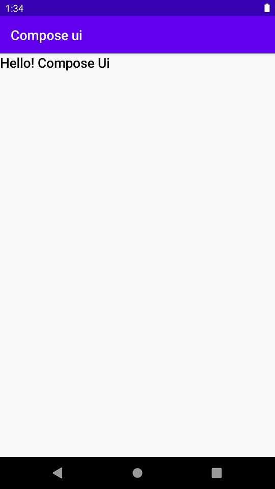
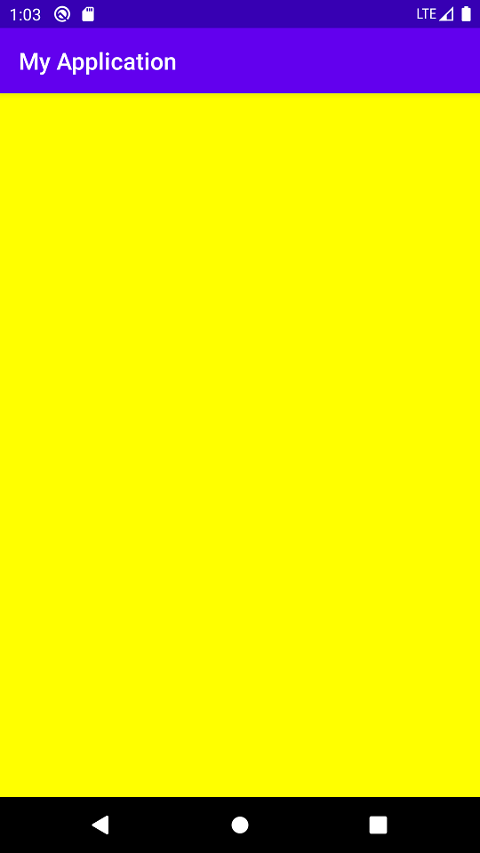
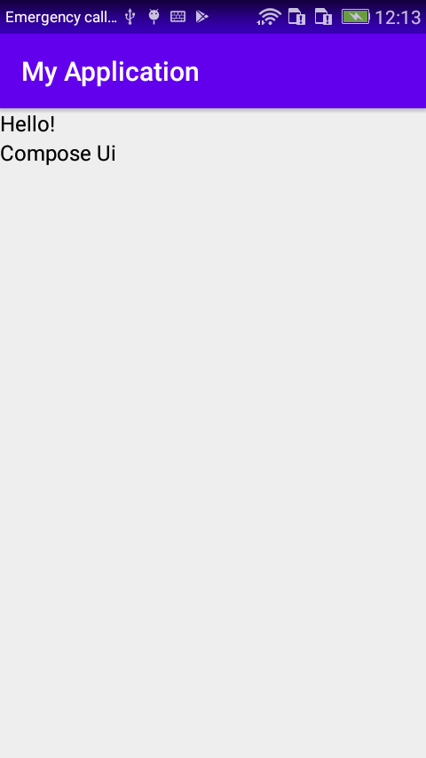
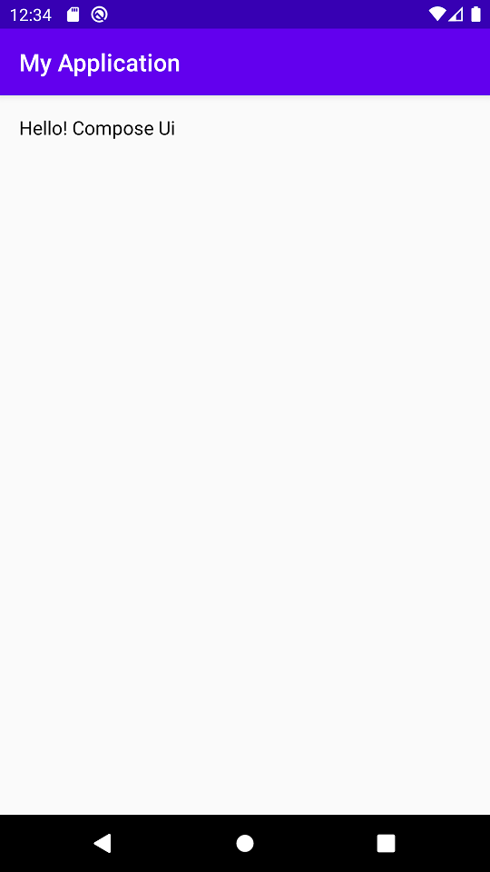

# android-compose-ui
Android’s modern toolkit for building native UI

### Table of Contents
- [Android Compose Ui](#composeui)
    - [Table of Contents](#table-of-contents)
- [Resource](#resource)
- [View](#view)
    - [Text](#text)
- [Layout](#layout)
    - [Background](#background)
    - [Column](#column)
    - [Row](#row)

# Resource
- [Android Compose Tutorials (Official)](https://developer.android.com/jetpack/compose)
- [Jetpack Compose Basics (Codelabs)](https://codelabs.developers.google.com/codelabs/jetpack-compose-basics/index.html)

# View

### Text
To show a text in compose ui just write 
```Kotlin
Text("Hello! Compose Ui")    
```

<details><summary>Screenshot</summary>
<p>



</p>
</details>

To add style in text 
```Kotlin
Text(text = "Hello! Compose Ui",
    style = +themeTextStyle { h6 }
)  
```

<details><summary>Screenshot</summary>
<p>



</p>
</details>

# Layout

### Background
To use color as background 
```Kotlin
Surface(color = Color.Yellow) {
        
}
```

<details><summary>Screenshot</summary>
<p>



</p>
</details>

### Column
Shows child view vertically
```Kotlin
Column {
      Greeting("Hello!")
      Greeting("Compose Ui")
}
```

<details><summary>Screenshot</summary>
<p>



</p>
</details>

### Row
Shows child view horizontally
```Kotlin
Row {
      Greeting("Hello!")
      Greeting("Compose Ui")
}
```

<details><summary>Screenshot</summary>
<p>



</p>
</details>
